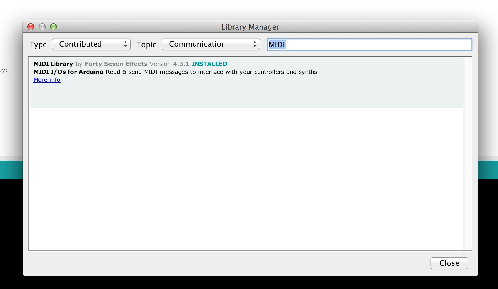

# Arduino MIDI Library

[](https://travis-ci.org/FortySevenEffects/arduino_midi_library)
[](https://coveralls.io/github/FortySevenEffects/arduino_midi_library)
[](https://github.com/FortySevenEffects/arduino_midi_library/releases/latest)
[](LICENSE)

This library adds MIDI I/O communications to an Arduino board.

### Features

-   **New** : MIDI over USB, Bluetooth, IP & AppleMIDI (see [Transports](#other-transport-mechanisms)).
-   **New** : Active Sensing support
-   Compatible with all Arduino boards (and clones with an AVR processor).
-   Simple and fast way to send and receive every kind of MIDI message (including all System messages, SysEx, Clock, etc..).
-   OMNI input reading (read all channels).
-   Software Thru, with message filtering.
-   [Callbacks](https://github.com/FortySevenEffects/arduino_midi_library/wiki/Using-Callbacks) to handle input messages more easily.
-   Last received message is saved until a new one arrives.
-   Configurable: [overridable template-based settings](https://github.com/FortySevenEffects/arduino_midi_library/wiki/Using-custom-Settings).
-   Create more than one MIDI interface for mergers/splitters applications.
-   Use any serial port, hardware or software.

### Getting Started

1. Use the Arduino Library Manager to install the library.
   

2. Start coding:

```c++
#include <MIDI.h>

// Create and bind the MIDI interface to the default hardware Serial port
MIDI_CREATE_DEFAULT_INSTANCE();

void setup()
{
    MIDI.begin(MIDI_CHANNEL_OMNI);  // Listen to all incoming messages
}

void loop()
{
    // Send note 42 with velocity 127 on channel 1
    MIDI.sendNoteOn(42, 127, 1);

    // Read incoming messages
    MIDI.read();
}
```

3. Read the [documentation](#documentation) or watch the awesome video tutorials from [Notes & Volts](https://www.youtube.com/playlist?list=PL4_gPbvyebyH2xfPXePHtx8gK5zPBrVkg).

## Documentation

-   [Doxygen Extended Documentation](https://fortyseveneffects.github.io/arduino_midi_library/).
-   [GitHub wiki](https://github.com/FortySevenEffects/arduino_midi_library/wiki).

## USB Migration (4.x to 5.x)

All USB related code has been moved into a separate repository [Arduino-USB-MIDI](https://github.com/lathoub/Arduino-USBMIDI), USB MIDI Device support with [`MIDIUSB`](https://github.com/arduino-libraries/MIDIUSB), still using this library to do all the MIDI heavy-lifting.

Migration has been made as easy as possible: only the declaration of the MIDI object has been modified, the rest of your code remains identical.

`4.3.1` code:

```c++
#include <MIDI.h>
#include <midi_UsbTransport.h>

static const unsigned sUsbTransportBufferSize = 16;
typedef midi::UsbTransport<sUsbTransportBufferSize> UsbTransport;

UsbTransport sUsbTransport;

MIDI_CREATE_INSTANCE(UsbTransport, sUsbTransport, MIDI);

// ...
```

now becomes in `5.x`:

```c++
#include <USB-MIDI.h>
USBMIDI_CREATE_DEFAULT_INSTANCE();

// ...
```

Start with the [NoteOnOffEverySec](https://github.com/lathoub/Arduino-USBMIDI/blob/master/examples/NoteOnOffEverySec/NoteOnOffEverySec.ino) example that is based on the original MidiUSB [sketch](https://github.com/lathoub/arduino_midi_library/blob/master/examples/MidiUSB/MidiUSB.ino). Note the only difference is in the declaration.

The [USB-MIDI](https://github.com/lathoub/Arduino-USBMIDI) Arduino library depends on [this library](https://github.com/FortySevenEffects/arduino_midi_library) and the [MIDIUSB](https://github.com/arduino-libraries/MIDIUSB) library.

[USB-MIDI](https://github.com/lathoub/Arduino-USBMIDI) uses the latest Arduino IDE `depends` feature in the `library.properties` file installing all the dependencies automatically when installing from the IDE.

## Other Transport mechanisms

Version 5 of this library, allows for other Transport layers than the
original MIDI 1.0 Electrical Specification (hardware serial).

-   [USB-MIDI](https://github.com/lathoub/Arduino-USBMIDI)
-   [AppleMIDI or rtpMIDI](https://github.com/lathoub/Arduino-AppleMIDI-Library)
-   [ipMIDI](https://github.com/lathoub/Arduino-ipMIDI)
-   [BLE-MIDI](https://github.com/lathoub/Arduino-BLE-MIDI)

All these Transport layers use this library for all the underlying MIDI
work, making it easy to switch transport protocols or making transport
protocol bridges.

### Differences between Serial & other transports

-   Software Thru is enabled by default on Serial, but not on other transports.

## Contact

To report a bug, contribute, discuss on usage, or simply request support, please [create an issue here](https://github.com/FortySevenEffects/arduino_midi_library/issues/new).

You can also contact me on Twitter: [@fortysevenfx](https://twitter.com/fortysevenfx).

## Contributors

Special thanks to all who have contributed to this open-source project !

-   [@lathoub](https://github.com/lathoub)
-   [@jarosz](https://github.com/jarosz)
-   [@ivankravets](https://github.com/ivankravets)
-   [@insolace](https://github.com/insolace)
-   [@softegg](https://github.com/softegg)
-   [@per1234](https://github.com/per1234)
-   [@LnnrtS](https://github.com/LnnrtS)
-   [@DavidMenting](https://github.com/DavidMenting)
-   [@Rolel](https://github.com/Rolel)

You want to help ? Check out the [contribution guidelines](./CONTRIBUTING.md).

## License

MIT © 2009 - present [Francois Best](https://francoisbest.com)
